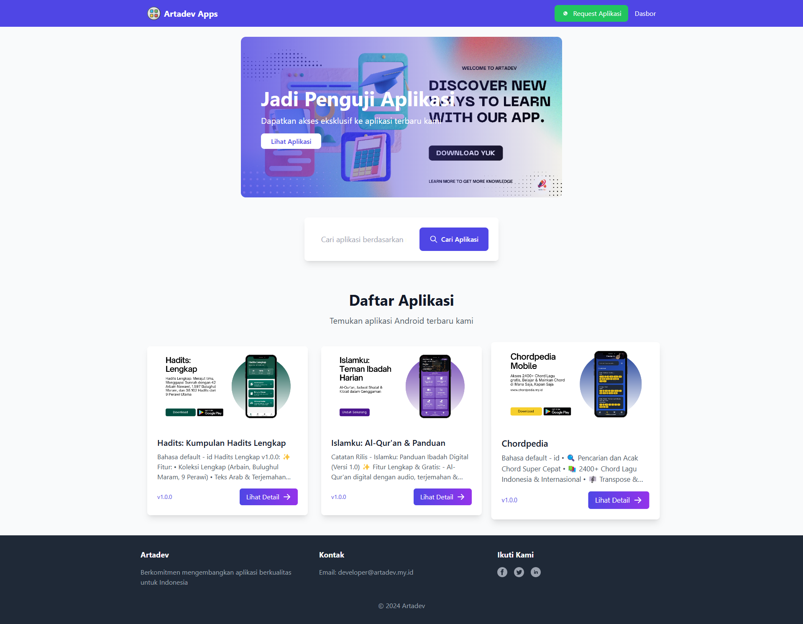

|  |

# 📱 ArtaDev App Showcase

Platform elegan untuk menampilkan dan mengelola aplikasi mobile dengan sistem pendaftaran beta tester.

## ✨ Fitur

### 📱 Manajemen Aplikasi
- Tampilkan beberapa aplikasi dengan informasi detail
- Unggah banner dan tangkapan layar aplikasi
- Lacak versi dan persyaratan aplikasi
- Kelola status visibilitas aplikasi
- Fungsi pencarian untuk aplikasi

### 👥 Sistem Beta Tester
- Pendaftaran tester yang ramah pengguna
- Undangan email otomatis
- Lacak pendaftaran tester
- Kemampuan mengirim ulang undangan
- Pelacakan status email

### 🔐 Dashboard Admin
- Autentikasi admin yang aman
- Manajemen tester secara real-time
- Ikhtisar statistik aplikasi
- Operasi CRUD aplikasi yang mudah
- Antarmuka yang ramah pengguna

## 🚀 Instalasi

1. Klon repositori:
```bash
git clone https://github.com/3snanugraha/app-showcase.git
cd app-showcase
```
2. Instal dependensi:
```bash
composer install
npm install
```
3. Pengaturan Environment Variabel:
```bash
cp .env.example .env
php artisan key:generate
```
4. Konfigurasi Database:
```bash
DB_CONNECTION=mysql
DB_HOST=127.0.0.1
DB_PORT=3306
DB_DATABASE=artadev-app-showcase
DB_USERNAME=root
DB_PASSWORD=
```
5. Konfigurasi pengaturan email di .env:
```bash
MAIL_MAILER=smtp
MAIL_HOST=mail.artadev.my.id
MAIL_PORT=465
MAIL_USERNAME=developer@artadev.my.id
MAIL_PASSWORD=your-password
MAIL_ENCRYPTION=ssl
MAIL_FROM_ADDRESS="developer@artadev.my.id"
MAIL_FROM_NAME="ArtaDev Apps"
```
6. Jalankan Migrasi dan Seeder:
```bash
php artisan migrate:fresh --seed
```
7. Hubungkan Storage:
```bash
php artisan storage:link
```
8. Build aset:
```bash
npm run dev
```
9. Mulai server pengembangan:
```bash
php artisan serve
```

## Akses Admin Default:
```bash
localhost/login
Email: admin@artadev.my.id
Password: admin
```

### 💡 Penjelasan Fitur Utama
Tampilan Aplikasi
Desain responsif untuk semua perangkat
Dukungan media yang kaya untuk presentasi aplikasi
Tampilan informasi aplikasi yang detail
Kemampuan pencarian dan filter

Manajemen Tester
Sistem email otomatis
Pelacakan pendaftaran tester
Pemantauan status email
Penanganan undangan massal

Fitur Admin
Sistem autentikasi yang aman
Pembaruan dashboard real-time
Manajemen konten yang mudah
Ikhtisar statistik

🤝 Kontribusi
Fork repositori
Buat branch fitur Anda
Commit perubahan Anda
Push ke branch
Buat Pull Request

📝 Lisensi
Proyek ini dilisensikan di bawah Lisensi MIT.

🌟 Dukungan
Untuk dukungan, email developer@artadev.my.id